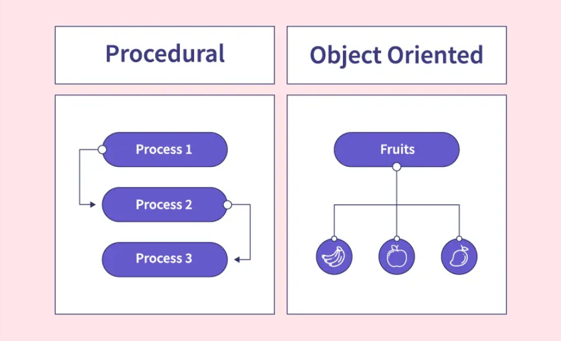

# POP vs OOP 



Programming languages can be classified in two categories. Procedural programming language and object oriented programming (OOP) languages. 

Procedural programming is about writing procedures or methods that perform operations on the data while object-oriented programming is about creating objects that contain both data and methods.

OOP presents several advantages:

- OOP provides a clear structure for the programs
- OOP is faster and easier to execute due to its structure.
- OOP helps to keep the Java code DRY "Don't Repeat Yourself", and makes the code easier to maintain, modify and debug
- OOP makes it possible to create full reusable applications with less code and shorter development time


## Classes and Objects

A Class is like an object constructor, or a "blueprint" for creating objects. It defines attributes (variables) and behaviors (methods) associated with an object.

```java
public class Main {   // Main class

	int x = 2;        // Modiable attribute
	final int y = 3;  // Unmodiable attribute

	static void myMethod(){ // Method
		System.out.println("I am in a method.")
	}
	
    public static void main(String[] args) {
        // Creating an object of the Car class
		Main myObj1 = new Main();      // Object 1
		myObj1.x = 3
		System.out.println(myObj1.x)
		
		Main myObj2 = new Main();      // Object 2
		System.out.println(myObj2.y)
		
		
        myMethod();                     // Call the method
        
        // Calling the displayInfo method
        myCar.displayInfo();
    }
}

```
#### Constructor
A constructor in Java is a special method that is used to initialize objects. The constructor is called when an object of a class is created. It can be used to set initial values for object attributes

Note that the constructor name must match the class name, and it cannot have a return type (like void). Also note that the constructor is called when the object is created. All classes have constructors by default: if you do not create a class constructor yourself, Java creates one for you. However, then you are not able to set initial values for object attributes.

```java
// Defining a class named Car
class Car {
    // Attributes (variables)
    String brand;
    String model;
    int year;

    // Constructor to initialize object attributes
    public Car() { // Default constructo
        this.brand = "Toyota";
        this.model = "Rav4";
        this.year = 1994;
    }
    public Car(String brand, String model, int year) { // Constructor with parameters
        this.brand = brand;
        this.model = model;
        this.year = year;
    }

    // Method to display car details
    public void displayInfo() {
        System.out.println("Car: " + brand + " " + model + " (" + year + ")");
    }
}

// Main class to run the program
public class Main {
    public static void main(String[] args) {
        // Creating an object of the Car class
        Car myCar1 = new Car();
        Car myCar2 = new Car("Toyota", "Camry", 2022);
        
        // Calling the displayInfo method
        myCar1.displayInfo();
        myCar2.displayInfo();
    }
}

```

###### Access and Non-Access Modifiers in Java

######## Access Modifiers

| Modifier    | For Classes? | For Attributes, Methods, Constructors? | Description                                                         |
| ----------- | ------------ | -------------------------------------- | ------------------------------------------------------------------- |
| `public`    | ✅ Yes        | ✅ Yes                                  | Accessible by all classes.                                          |
| `private`   | ❌ No         | ✅ Yes                                  | Accessible only within the declared class.                          |
| `default`   | ✅ Yes        | ✅ Yes                                  | Accessible within the same package (when no modifier is specified). |
| `protected` | ❌ No         | ✅ Yes                                  | Accessible within the same package and by subclasses.               |
######## Non-Access Modifiers

| Modifier                       | Description                                                                                |
| ------------------------------ | ------------------------------------------------------------------------------------------ |
| **For Classes**                |                                                                                            |
| `final`                        | The class cannot be inherited.                                                             |
| `abstract`                     | The class cannot be instantiated (must be inherited).                                      |
| **For Attributes and Methods** |                                                                                            |
| `final`                        | Cannot be overridden or modified. Can be accessed without creating an object of the class. |
| `static`                       | Belongs to the class rather than an object.                                                |
| `abstract`                     | Used in abstract classes; methods have no body, implemented by subclasses.                 |
| `transient`                    | Skipped during serialization.                                                              |
| `synchronized`                 | Allows only one thread to access a method at a time.                                       |
| `volatile`                     | Ensures the variable is always read from main memory (not cached by threads).              |


## Encapsulation
Sensitive data is hidden from direct access by users. It allows programmers to control access to an object's attributes, improving data security and flexibility. 
 In Java, encapsulation is achieved by:

- Declaring class variables (attributes) as private, making them inaccessible outside the class.
- Providing public getter and setter methods to access and modify these private variables.

```java
// Encapsulated class
class Person {
    // Private variable (cannot be accessed directly)
    private String name;

    // Getter method to access the private variable
    public String getName() {
        return name;
    }

    // Setter method to update the private variable
    public void setName(String newName) {
        this.name = newName;
    }
}

// Main class
public class Main {
    public static void main(String[] args) {
        // Creating an object of the Person class
        Person person = new Person();
        
        // Using setter to set a value
        person.setName("Alice");

        // Using getter to retrieve the value
        System.out.println("Person's Name: " + person.getName());
    }
}
```


## Inheritance

**Inheritance** is a fundamental concept in object-oriented programming that allows one class to acquire the attributes and methods of another class. This promotes **code reusability** and establishes a structured class hierarchy. Inheritance needs three components:

- **Superclass (Parent Class)** : This is the existing class from which attributes and methods are inherited.
- **Subclass (Child Class)** : This is the class that inherits from the **superclass**. It can use and extend the functionalities of the parent class
- **`extends` Keyword** : The `extends` keyword is used to establish inheritance between a subclass and a superclass.

```java
// Superclass (Parent Class)
class Animal {
    protected String name; // Only accesssible by subclasses

    void makeSound() {
        System.out.println("Animal makes a sound");
    }
}

// Subclass (Child Class) that inherits from Animal
class Dog extends Animal {
    void bark() {
        System.out.println(name + " barks");
    }
}

// Main class to test inheritance
public class Main {
    public static void main(String[] args) {
        Dog myDog = new Dog();
        myDog.name = "Buddy";  // Inherited from Animal class
        myDog.makeSound();      // Inherited method
        myDog.bark();           // Own method
    }
}

```

###### **Benefits of Inheritance:**

✅ **Code Reusability** – Avoids redundant code by allowing subclasses to reuse parent class functionality.  
✅ **Better Organization** – Establishes a clear class hierarchy, making the code more structured.  
✅ **Easier Maintenance** – Changes in the parent class automatically apply to child classes, reducing maintenance effort.


## Polymorphisme

**Polymorphism** means **"many forms"** and allows a method to perform different tasks in related classes. It enables a single interface to be used for different types, enhancing **code reusability** and **flexibility** in object-oriented programming.

###### **Types of Polymorphism:**

1. **Method Overriding (Runtime Polymorphism)**
    - Occurs when a subclass **overrides** a method from its parent class.
    - The method signature remains the same, but the implementation is different.

```java
// Parent Class
class Animal {
    void makeSound() {
        System.out.println("Animal makes a sound");
    }
}

// Child Class overriding makeSound() method
class Dog extends Animal {
    @Override
    void makeSound() {
        System.out.println("Dog barks");
    }
}

// Main Class
public class Main {
    public static void main(String[] args) {
        Animal myAnimal = new Dog(); // Parent reference, Child object
        myAnimal.makeSound(); // Calls Dog's overridden method (Output: Dog barks)
    }
}
```

2. **Method Overloading (Compile-time Polymorphism)**
    - Occurs when multiple methods in the same class have the **same name** but different parameters.
    - The method call is resolved at **compile-time** based on parameter types.

**Example of Method Overloading:**

```java
class MathOperations {
    // Method with two parameters
    int add(int a, int b) {
        return a + b;
    }

    // Overloaded method with three parameters
    int add(int a, int b, int c) {
        return a + b + c;
    }
}

// Main Class
public class Main {
    public static void main(String[] args) {
        MathOperations math = new MathOperations();
        System.out.println(math.add(5, 10));        // Calls the two-parameter method
        System.out.println(math.add(5, 10, 15));    // Calls the three-parameter method
    }
}
```

###### **Key Benefits of Polymorphism**

✅ **Code Reusability** – Allows a single method to work with different types and classes.  
✅ **Flexibility** – The same method name can be used for different tasks, improving readability.  
✅ **Scalability** – New functionalities can be added without modifying existing code.


## Abstraction

Data abstraction is a fundamental concept in Java that involves hiding unnecessary details while exposing only essential information to the user. This helps in simplifying complex systems by focusing on what an object does rather than how it does it. In Java, abstraction is implemented using abstract classes and interfaces. 


An abstract class is a class that cannot be instantiated and serves as a blueprint for other classes. It can contain both abstract methods (methods without a body) and regular methods (with a defined implementation). A subclass must inherit from the abstract class and provide concrete implementations for its abstract methods.

The main advantage of abstraction is security—it prevents direct access to implementation details while ensuring that only the necessary functionalities are exposed. Interfaces, another way to achieve abstraction, will be explored in the next chapter.

```java
// Abstract class
abstract class Animal {
    // Abstract method (no body)
    abstract void makeSound();

    // Concrete method (has body)
    void sleep() {
        System.out.println("Sleeping...");
    }
}

// Subclass that provides implementation
class Dog extends Animal {
    @Override
    void makeSound() {
        System.out.println("Dog barks");
    }
}

// Main class
public class Main {
    public static void main(String[] args) {
        Animal myDog = new Dog(); // Create a Dog object
        myDog.makeSound(); // Calls overridden method (Output: Dog barks)
        myDog.sleep();     // Calls inherited concrete method (Output: Sleeping...)
    }
}
```
## Interface

An interface in Java is a completely abstract class that defines a set of methods without implementation. It serves as a blueprint for classes, ensuring that they follow a specific structure.

Unlike regular classes, an interface cannot be instantiated and must be implemented by another class using the implements keyword (instead of extends for abstract class). The implementing class provides the method bodies for all the methods declared in the interface.

Interfaces share similarities with abstract classes, but they have key differences:

- All methods in an interface are public and abstract by default.
- All attributes in an interface are public, static, and final by default.
- Interfaces cannot have constructors, as they cannot be used to create objects.

Interfaces provide security by exposing only essential details of an object while hiding the implementation. Additionally, they allow multiple inheritance, which Java does not support with regular classes. A class can implement multiple interfaces, making them a powerful tool for designing flexible and scalable applications.

```java
// Interface with abstract methods
interface Animal {
    void makeSound(); // Method signature (no body)
}

// Implementing the interface in a class
class Cat implements Animal {
    @Override
    public void makeSound() {
        System.out.println("Cat meows");
    }
}

// Main class
public class Main {
    public static void main(String[] args) {
        Animal myCat = new Cat(); // Create a Cat object
        myCat.makeSound(); // Calls implemented method (Output: Cat meows)
    }
}
```


## Difference Abstraction vs Interfaces

| Points                | Abstract Class                                                                                                     | Interface                                                                           |
| --------------------- | ------------------------------------------------------------------------------------------------------------------ | ----------------------------------------------------------------------------------- |
| Definition            | Cannot be instantiated; contains both abstract (without implementation) and concrete methods (with implementation) | Specifies a set of methods a class must implement; methods are abstract by default. |
| Implementation Method | Can have both implemented and abstract methods.                                                                    | Methods are abstract by default; Java 8, can have default and static methods.       |
| Inheritance           | class can inherit from only one abstract class.                                                                    | A class can implement multiple interfaces.                                          |
| Access Modifiers      | Methods and properties can have any access modifier (public, protected, private).                                  | Methods and properties are implicitly public.                                       |
| Variables             | Can have member variables (final, non-final, static, non-static).                                                  | Variables are implicitly public, static, and final (constants).                     |


## Java Enum – A Special Type of Class

An enum is a special type of class used to define a fixed set of constants. It is similar to a class but is primarily used for representing values that do not change, such as days of the week, colors, or directions. 

Enums provide clarity, type safety, and better code organization when working with a fixed set of values. They help prevent errors by restricting variables to predefined options, making them useful for scenarios like defining days of the week, color palettes, or card suits.

|Feature|Enum|Regular Class|
|---|---|---|
|**Purpose**|Represents a fixed set of constants|Used for general object creation|
|**Constants**|Public, static, and final by default|Must be explicitly defined|
|**Object Creation**|Cannot create instances|Can create objects using `new`|
|**Inheritance**|Cannot extend other classes|Can extend other classes|
|**Implements Interfaces**|Yes|Yes|


```java
enum Day { 
	SUNDAY, MONDAY, TUESDAY, WEDNESDAY, THURSDAY, FRIDAY, SATURDAY; 
}

// Enum with Constructor and Method
enum Color {
    RED("##FF0000"),
    GREEN("##00FF00"),
    BLUE("##0000FF");

    private String hexCode;

    // Constructor
    Color(String hexCode) {
        this.hexCode = hexCode;
    }

    // Getter Method
    public String getHexCode() {
        return hexCode;
    }
}

// Main Class
public class Main {
    public static void main(String[] args) {
		// Use Day enum
	    Day today = Day.WEDNESDAY;
        System.out.println("Today is: " + today);
       
	    // Use Color enum
        Color favoriteColor = Color.BLUE;
        System.out.println("Favorite color hex code: " + favoriteColor.getHexCode());
    }
}

```
